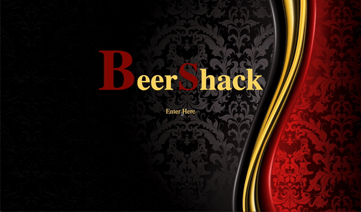
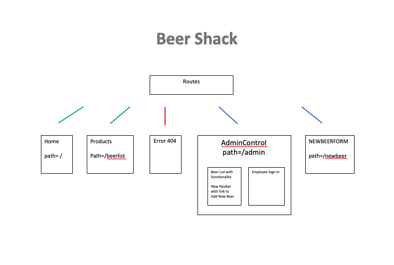

# **Beer Shack**

###### By Trevor Mackin 02/21/2020  

### **Description**

_This is a client-side application built in React. The focus of this project was to practice drilling down props to lower level components, and to show a fundamental understanding of lifting state. The application uses a brewery site that allows a user from the outside to view a list of all products. There is also an option for an administrator that will present a user with additional options in order to have more functionality. From here, the admin can add new beers to the products list, or hit a button to order a beer that will be subtracted from a keg that begins with 124 pints._

_Please note that this is a second week project in React, so there are definitely some improvements that can be made. Most notably, using Redux to directly pass props from parent to child rather than taking the long path down the component tree. The authorization in this application is also subpar, but I hope to address this is the recent future as we progress through this course._ 
#

###  **Setup/Installation Requirements**

1. Open https://ratta2ii.github.io/beerShack.react
2. git clone https://github.com/ratta2ii/beerShack-react.git (Clone repository to local machine)
3. cd beerShack-react (Navagate to the project directory) 
4. $ npm install
5. $ npm run start
#
   
### **Component Tree (Planning Phase)**

### **Technologies Used**

* React
* JavaScript
* Html
* Css
* Webpack

### **License**

Copyright (c) 2019 **Trevor Mackin**
